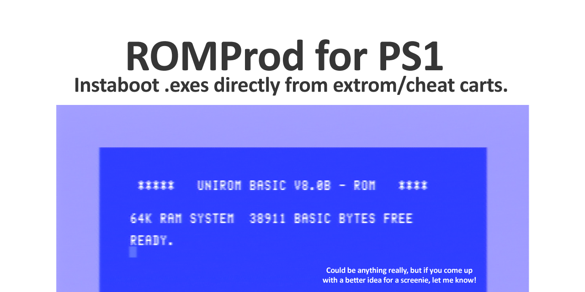

# ROMProd 0.4
	
    https://github.com/JonathanDotCel
    

    Allows you to pack .exe files into an instant-boot ROM for 
    the PS1 with optional compression.

    As of 0.4 we've switched from ASMPSX/spASM to using the GNU 
    assembler + Docker, etc via Nicolas Noble's awesome "nugget" setup.

# How do?
    
    - Install docker
    - Add this folder to docker
    - Run build_roms.bat

    - nops /rom rom_compressed.rom COM14
    
# Details?

    While version 0.3 used a fastboot replacement (manually calling)
    various setup routines for devices, events, etc as the BIOS would,
    version 0.4 allows the BIOS to boot normally, and interrupts just
    before it loads the shell with all the noise and graphics, etc.
    
    It's often called a mid-boot hook and cuts down on code while also
    providing much better compatibility.
    
    
# Thanks
    
    ```c

static const char * const credits[] = {

    "Doofy",
    "Nocash <3",
    "Shendo",
    "Type 79",
    "Dax",
    "Jihad / Hitmen",
    "Silpheed / Hitmen",
    "SquareSoft74 (no spaces)",
    "Foo Chen Hon",    
    "DanHans / GlitterGirls",
    "Herben",
    "and asmblur",
    "JMiller",
    "Tim S / Firefly",
    "rama (any version)",
    "Angus McFife XIII",
    "Padua",
    "Blackbag",
    "Napalm",
    "Paradox / Paradogs :p",
    "XPlorer Peeps",
    "K-Comms Peeps",
    "barog",
    "L0ser",
    "cybdyn",
    "paul",
    "Peter Lemon",
    "and krom",
    "Brian Marshall",
    "Mistamotiel",
    "and Mistamontiel...",
    "tieigo",
    "orion",
    "Codeman",
    "Cat",
    "LordBlitter",
    "SurfSmurf",
    "kHn",
    "Nicolas Noble",
    "r0r0",
    "James-F",
    "Rich!",
    "The XStation Testers!",
    "Trimesh",
    "Murray Moffat",
    "xianaix",
    "ChenThread",
    "Everyone at PSXDev!",
    "Tetley.co.uk",
    "And my best pal",
    "Lameguy64",
    "he's alright"  // lol just kidding, he's helped loads

    // And an extra special thanks to SquareSoft74, DanHans, Nicolas Noble and Rama who've been absolute fucking
    // legends with their support and advice!

};

```

    Yeah, it's just the unirom credits crawler :)